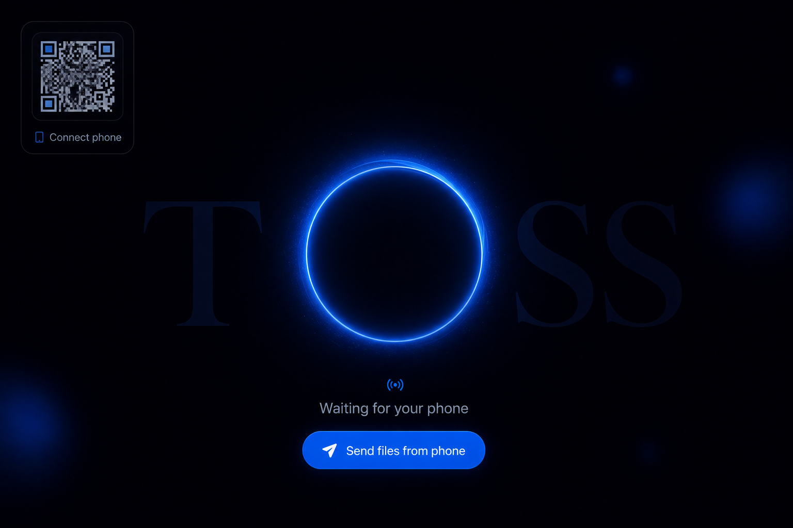
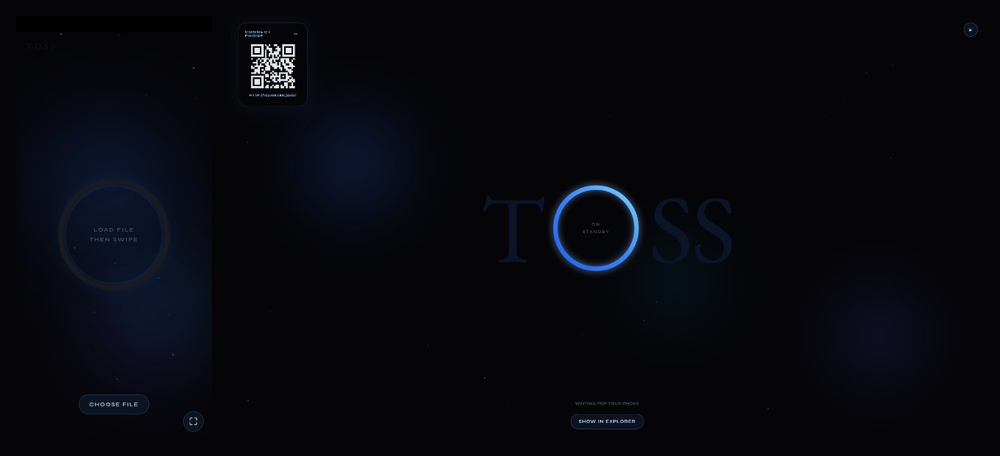

# Toss

<p align="center">
  
</p>

<p align="center">
  <strong>Send files from your phone to your PC with a swipe.</strong><br>
  Same Wi‑Fi · no login · Windows
</p>

<p align="center">
  <a href="https://github.com/gamberoferoce/Toss/releases/latest">
    
  </a>
</p>

<p align="center">
  
  
  
</p>

<p align="center">
  
  <br>
  <sub>Phone · PC</sub>
</p>

## How it works

1. **Run Toss** on your PC — a QR code appears on screen
2. **Scan with your phone**, pick a file, and swipe up to send
3. **File received** — saved to your incoming folder on the PC

## Demo video

<p align="center">
  <a href="https://youtube.com/shorts/KNmo2pVBbmk">
    
  </a>
  <br><br>
  <strong><a href="https://youtube.com/shorts/KNmo2pVBbmk">▶ Watch on YouTube</a></strong> · 12 seconds
</p>

## Download

1. Open the **[latest release](https://github.com/gamberoferoce/Toss/releases/latest)**
2. Download `Toss.zip`
3. Extract all files to one folder
4. Double-click **Toss.exe**

The zip contains `Toss.exe`, `TossServer.exe`, and `README.txt` (usage and troubleshooting).

You do not need to clone this repository to use Toss.

## Network & privacy

Toss is meant for a **network you control** (home, studio, gallery). Anyone on the same Wi‑Fi can send files to the PC while Toss is running. There is no password — that keeps setup instant. Do not use on public or guest Wi‑Fi.

## Develop

Requirements: **Windows 10/11**, **Node.js 18+**, **.NET 8 SDK** (for the WebView2 host).

```bash
git clone https://github.com/gamberoferoce/Toss.git
cd Toss
npm install
npm start
```

- PC receiver: `http://127.0.0.1:3000/receiver/`
- Phone sender: URL shown in the server console / QR (same Wi‑Fi)

WebView2 host in dev:

```bash
# terminal 1
set TOSS_OPEN=0
npm start

# terminal 2
dotnet run --project host
```

`Toss.exe` shows an animated splash (same background as the receiver) while the server starts, then opens the receiver UI.

Build the distribution zip:

```bash
npm run pack
```

Output: `dist/Toss.zip`

Publish a GitHub Release (requires [GitHub CLI](https://cli.github.com/) logged in once: `gh auth login`):

```bash
npm run release
```

## Project layout

| Path | Role |
|------|------|
| `server/` | Express server, upload, WebSocket |
| `swipe/` | Phone sender UI |
| `receiver/` | PC receiver UI |
| `host/` | `Toss.exe` WebView2 shell + startup splash |
| `scripts/` | Embed UI, pack zip, icon |
